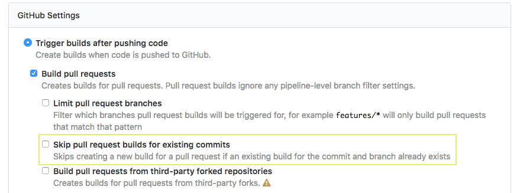

# GitHub Pull Request Plugin

A [Buildkite plugin](https://buildkite.com/docs/agent/v3/plugins) to build the merged state of pull requests.

This means that builds will run against what the merged commit will be, rather than what is in the PR, reducing the risk of bad merges breaking master/trunk.

Why would I want this?
 1. Parity with other CI setups. Including [TeamCity](https://blog.jetbrains.com/teamcity/2013/02/automatically-building-pull-requests-from-github-with-teamcity/), Travis, and [Jenkins](https://wiki.jenkins.io/display/JENKINS/GitHub+pull+request+builder+plugin).
 2. Can help avoid building stale branches, as CI is done against the target branch at the time of the PR being raised rather than when the source branch was created
 3. Reduce the risk of failed builds from reaching master, due to bad merges (See the example at the bottom of this document)

While this approach doesn't mitigate breaking changes made to the target branch branch *after* the PR is raised, it does help reduce the [time] window in which bad merges can appear -- the thinking being the age of a PR is clearly visible on GitHub unlike the age of the parent commit for a PR branch.

# Modes

The plugin has two modes:
  - `mode: trigger` to async trigger another build (of the current pipeline); and
  - `mode: checkout` to merge the PR after checking out source

# Example

Ensure `Skip pull request builds for existing commits` is set to `false` in your Pipeline settings, as BuildKite will build the branch and skip the PR build.



## Checkout Mode
When using `checkout` mode, the plugin should be specified on each build step (e.g. where a checkout happens).

```yml
plugins: &plugins
  seek-oss/github-merged-pr#v1.0.1:
    mode: checkout

steps:
  - label: 'Make something'
    commands:
      - make something
    plugins:
      <<: *plugins

  - label: 'Make something else'
    commands:
      - make something-else
    plugins:
      <<: *plugins
```

## Trigger Mode
In `trigger` mode the plugin should only be specified on one step, to prevent triggering multiple builds.

```yml
steps:
  - label: 'Make something'
    commands:
      - make something
    plugins:
      seek-oss/github-merged-pr#v1.0.1:
        mode: trigger

  - label: 'Make something else'
    commands:
      - make something-else
```

# Tests

To run the tests of this plugin, run
```sh
docker-compose run --rm tests
```

# License

MIT (see [LICENSE](LICENSE))

# Bad Merge Example

An example of why it may be desirable to build the merged commit. Let's say you're raising a PR to implement an `add` function to a calculator that can already `subtract`:

`origin/master` (commit `1abcdef`): calculator.js
```
class Calculator {
  constructor() {
    this.currentAnswer = 0;
  }

  subtract(value) {
    this.currentAnswer -= value;
  }
}
```

(Tests omitted for brevity).

You create a branch locally to implement your feature

`feature/add` (commit `feba123`) (parent commit `1abcdef`): calculator.js
```
class Calculator {
  constructor() {
    this.currentAnswer = 0;
  }

  subtract(value) {
    this.currentAnswer -= value;
  }

  add(value) {
    this.currentAnswer += value;
  }
}
```

In the meantime, `origin/master` is updated to rename `currentAnswer` to `answer`.
`origin/master` (commit `56789ab`) (parent commit `1abcdef`): calculator.js
```
class Calculator {
  constructor() {
    this.answer = 0;
  }

  subtract(value) {
    this.answer -= value;
  }
}
```

You then raise your PR for `feature/add`, but:
 1. CI will run against the `HEAD` of the branch (commit `feba123`); and
 2. The PR will likely be merged (as tests pass) -- unless someone on your team notices; and
 3. The `git merge` will succeed (as there's no text conflicts); and
 4. The target branch (`master`) will be broken :(
